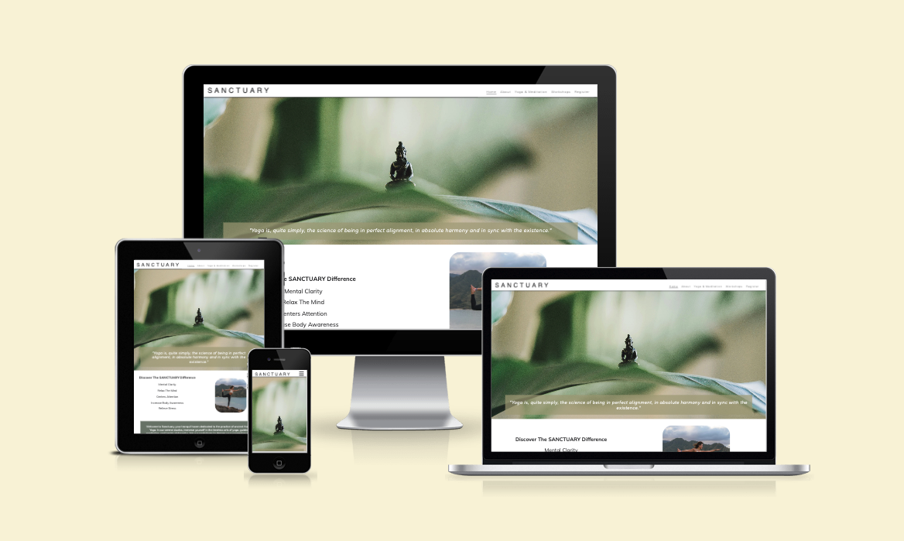
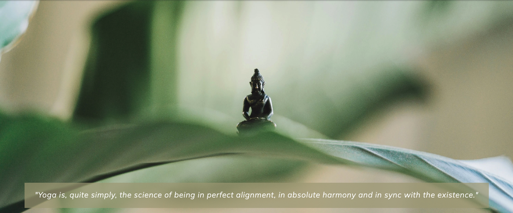
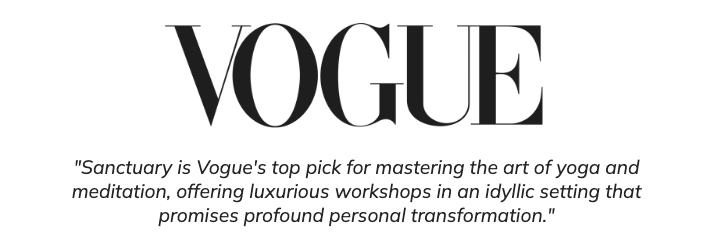

# Sanctuary
The Sanctuary website is a landing page designed for adults interested in traditional practices for their spiritual well-being. Sanctuary offers opportunities to attend workshops or retreats that integrate asanas, pranayama, and meditation as methods for enlightenment. These practices can be continued daily after the workshops.

Users of this website will find all the necessary information about Sanctuary: details about the studio, its location, contact information, an introduction to the yoga tradition offered, and a registration form. This site is targeted toward individuals who want to take the next step in their spiritual journey.

## Features

#### Navigation 
- The navigation bar is featured at the top of the page with the yoga studio's name, SANCTUARY, located at the top left corner and linking to the home page.
- The other navigation links are positioned on the right: Home, About, Yoga & Meditation, Workshops, and Register, all of which link to their respective HTML pages.
- The navigation uses a font similar to the studio name and features colors that contrast with the background.
- The navigation clearly displays the studio and website name, making it easy for users to find different pages of information. The currently selected page in the navigation is underlined, and pages also get underlined when hovered over.
 

### The Header

- The header features a hero image of a Buddha meditating, visually indicating the website's focus.
- The header includes a quote on yoga, reinforcing the website's theme.
- This section provides clear information about the studio and uses strong imagery to visualise its purpose.

### The Testimonial Section

- The testimonial section is designed to reinforce the studio's credibility.
- It features a prominently displayed Vogue brand logo, followed by a quote from Vogue praising the studio.

### The Footer

### Credits 
https://www.experienceretreats.com/bali-retreat-center-ubud - Source for outdoor-workshop.webp, gallery-image-11.webp

https://flexhk.com/wp-content/uploads/2019/07/ark-retreat-bali-yoga-shala.jpg - outdoor-workshop-2.webp

https://breathedreamgo.com/a-wellness-and-yoga-retreat-in-bali/ - gallery-image-5.webp

https://www.internationaltraveller.com/asia/indonesia/bali/is-this-balis-most-relaxing-hideaway/ - gallery-image-2.webp

https://www.pinterest.co.uk/pin/escape-haven-is-the-leading-womens-retreat-in-bali-with-yoga-surf-fitness-and-spa-retreat-packages-book--62839357282164894/ - pinterest, Escape Haven is the author - gallery-image-1.webp

https://thesoulfullifestyle.com.au/product/bali-retreat-yama/ - outdoor-workshop-3.webp

https://www.tripadvisor.co.uk/Hotel_Review-g12997583-d13331284-Reviews-Udara_Bali_Yoga_Detox_Spa-Seseh_Bali.html - gallery-image-4.webp

https://www.jimchapmancommunities.com/bali-training-retreat-k.html - gallery-image-3.webp

https://bookretreats.com/blog/10-top-yoga-retreats-in-bali/ - gallery-image-12.webp 

https://unsplash.com/photos/selective-focus-photography-of-black-buddha-figurine-on-green-leaf-0tTA6cewPr8 - Author Samuel Austin - unsplash - hero-image.webp

https://unsplash.com/photos/man-doing-yoga-on-rock-formation-P3gP2dZ5rnk - Jeremy Bishop - unsplash - Benefits-image.webp

https://unsplash.com/photos/woman-in-black-tank-top-sitting-on-brown-wooden-dock-during-daytime-xce530fBHrk - Author Jared Rice on Unsplash - gallery-image-6.webp 

https://unsplash.com/photos/woman-in-black-tank-top-and-black-shorts-raising-her-hands-rcSrzEf3NLs - Mor Shani Author on unsplashed - workshop-section.webp

https://www.takeustobali.com/home/best-places-to-organise-a-yoga-retreat-in-bali - gallery-image-7.webp

https://frstore.onlineclearance2024.ru/content?c=yoga+classes+in+seminyak+bali&id=26 - gallery-image-8.webp

https://www.baliecostay.com/activities/yoga-and-meditation/ - gallery-image-9.webp

https://www.themindfullifepractice.com/about - gallery-image-10.webp 

https://www.fourseasons.com/privatejet/journeys/timeless-encounters-2025/bali/ - outdoor-workshop-4.webp

https://www.cleanpng.com/png-vogue-italia-logo-fashion-magazine-model-agency-1774979/ - vogue.webp