# Sanctuary

The Sanctuary website is a landing page designed for adults interested in traditional practices for their spiritual well-being. Sanctuary offers opportunities to attend workshops or retreats that integrate asanas, pranayama, and meditation as methods for enlightenment. These practices can be continued daily after the workshops.

Users of this website will find all the necessary information about Sanctuary: details about the studio, its location, contact information, an introduction to the yoga tradition offered, and a registration form. This site is targeted toward individuals who want to take the next step in their spiritual journey.

The site can be accessed via this [link.](https://kelseyjaneadams.github.io/sanctuary-project/)

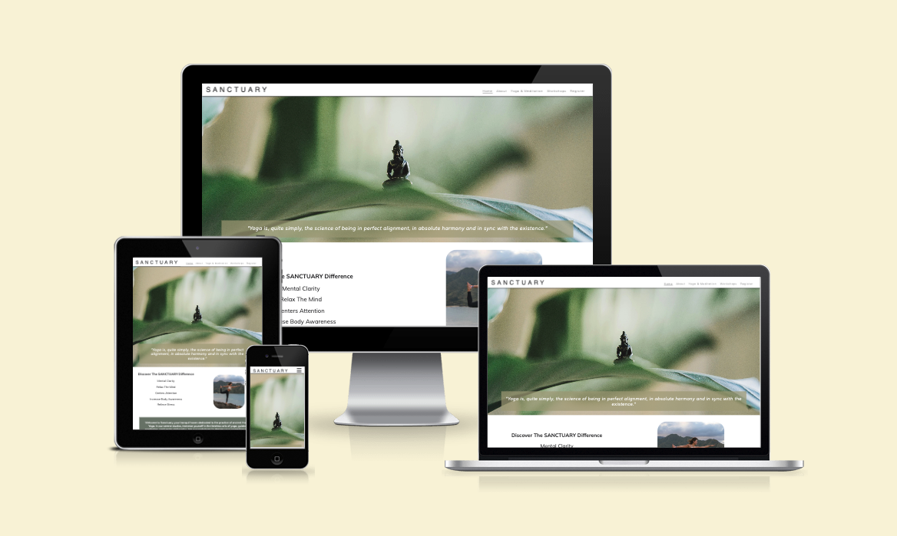

## User Stories

#### First Time Visitor Goals:
- As a First Time Visitor, I want to easily understand the main purpose of the site, so I can learn more about the yoga studio and its offerings.
- As a First Time Visitor, I want to be able to easily navigate through the website, so I can find information about the types of yoga classes and workshops available.
- As a First Time Visitor, I want to see testimonials so I can gauge the quality and reputation of the studio.

#### Returning Visitor Goals:
- As a Returning Visitor, I want to see the different yoga classes and workshops being offered, so I can choose the ones that interest me.
- As a Returning Visitor, I want to see detailed information about the yoga offered, so I can feel confident in their expertise and teaching style.
- As a Returning Visitor, I want to find a way to get in contact with the studio, so I can ask additional questions or register for a class or workshop.
- As a Returning Visitor, I want to find social media links, so I can learn more about the yoga community and events at the studio.

#### Frequent Visitor Goals
- As a Frequent Visitor, I want to check whether there are any new or updated yoga classes and workshops, so I can explore new options and enjoy a variety of classes.
- As a Frequent Visitor, I want to have options for contacting the studio for specific reasons, such as class registration or feedback, so I can get an appropriate and timely response.

## Features

#### Navigation 
- The navigation bar is featured at the top of the page with the yoga studio's name, SANCTUARY, located at the top left corner and linking to the home page.
- The other navigation links are positioned on the right: Home, About, Yoga & Meditation, Workshops, and Register, all of which link to their respective HTML pages.
- The navigation uses a font similar to the studio name and features colors that contrast with the background.
- The navigation clearly displays the studio and website name, making it easy for users to find different pages of information. The currently selected page in the navigation is underlined, and pages also get underlined when hovered over.
 

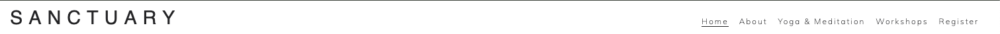

- On tablets and mobiles: The navigation bar maintains the logo on the left side but a hamburger menu is implemented.

- When the hamburger menu is clicked, a dropdown menu appears with the links to the pages in the same order.

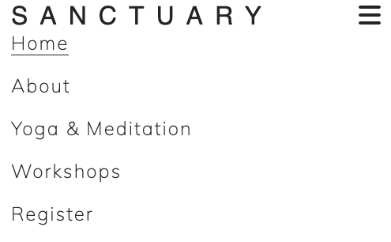

#### The Header

- The header features a hero image of a Buddha meditating, visually indicating the website's focus.
- The header includes a quote on yoga, reinforcing the website's theme.
- This section provides clear information about the studio and uses strong imagery to visualise its purpose.

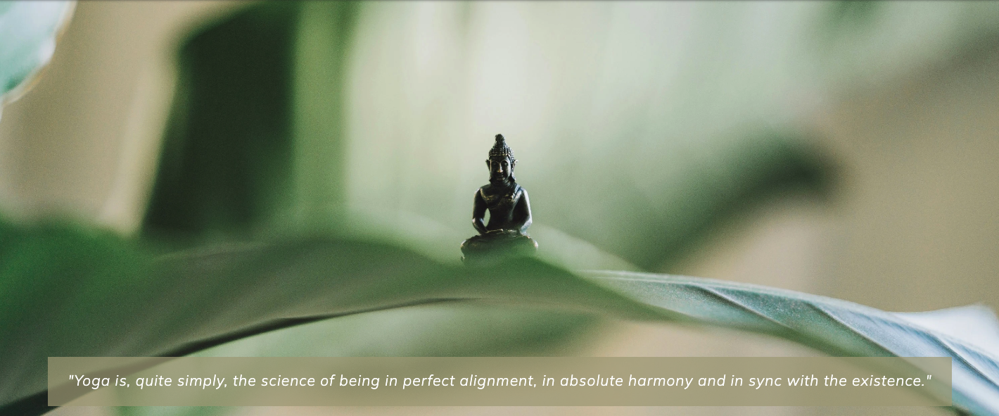

#### The Testimonial Section

- The testimonial section is designed to reinforce the studio's credibility.
- It features a prominently displayed Vogue brand logo, followed by a quote from Vogue praising the studio.

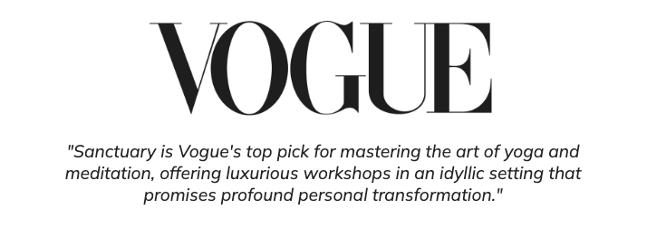

#### About Us Gallery
- The gallery feature in the "About Us" section provides a visual exposition of the studio and a glimpse into the setup of the workshops.
- The main image depicts a lady meditating on a mandapam in the forest, highlighting the unique and serene setting of the studio.
- Three smaller images underneath show the various locations where the workshops are conducted, giving prospective attendees a clear idea of the environment.

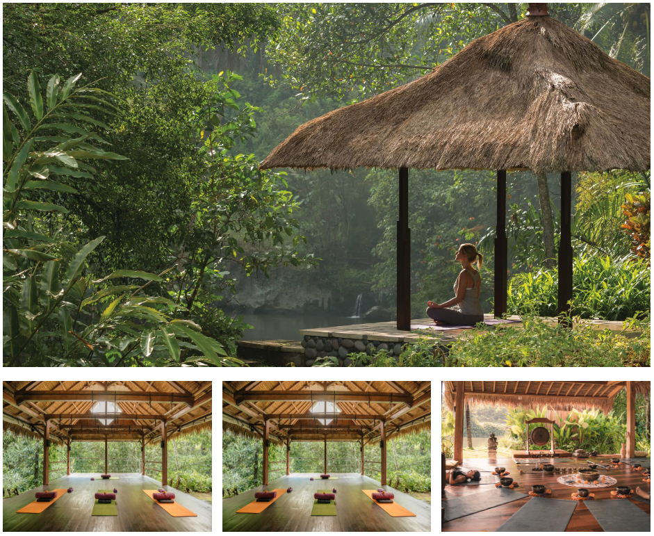

#### Find Us Map
- The "Find Us" section includes an embedded map. This provides users with a visual representation of the studio's location, making it easier for them to find the studio.
- The embedded map allows users to interact with it by zooming in, getting directions, and viewing streets. This provides all the necessary information without needing to leave the website.

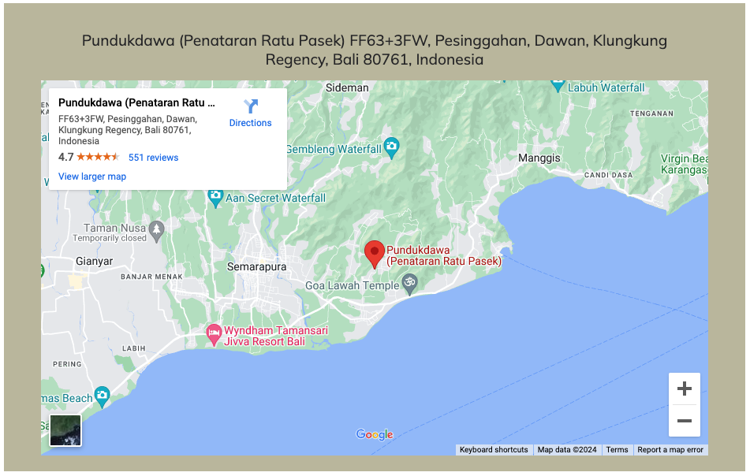

#### Video

- The Yoga & Meditation section includes an embedded video. This provides users with a visual and auditory introduction to what yoga is, making it more engaging.
- The embedded video has autoplay turned off and is set to mute by default to give a better user experience.
- The controls are available for the user to play, pause, and adjust the volume as needed, ensuring they have full control over their viewing experience.

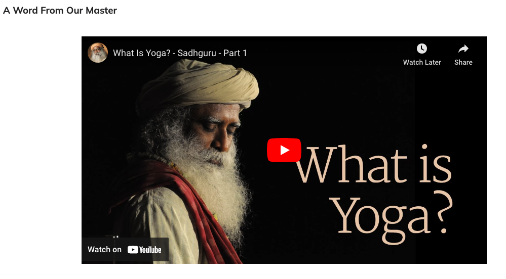

#### Workshop Grid
- The workshops section includes a visually appealing grid layout created using divs to demonstrate the different types of workshops offered at the studio.
- The grid organises workshops into four distinct categories: Bonding with the Elements, Moon Meditations, Sun Yoga, and Integrating Mind and Body. This clear organisation helps users quickly find the type of workshop they are interested in.
- Each category is represented by a coloured block with a descriptive title and a colour that contrasts with the background, making it easy for users to read, navigate, and understand the variety of workshops available.
- Each block includes an unordered list of specific workshops under the category, giving users detailed information at a glance and immediate insight into what each workshop entails.

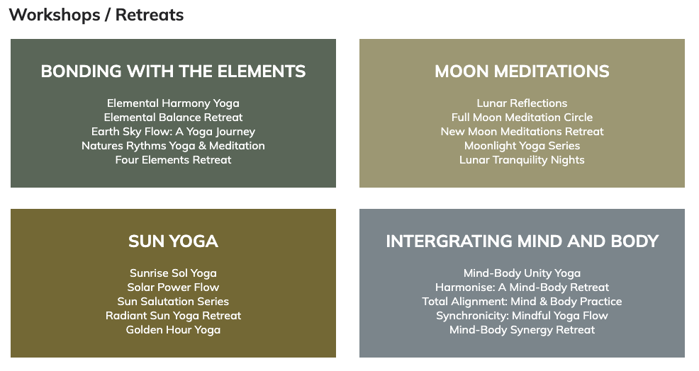

#### Workshop Gallery
- The Gallery section includes a visually appealing and immersive grid layout that showcases various images related to the workshops and retreats offered at the studio.
- The gallery provides users with a visual representation of the studio's environment, giving them a taste of what the workshop setups and retreats look like.
- By including high-quality images of yoga sessions, meditation practices, and the serene surroundings, the gallery engages users and helps them visualise the unique setting and atmosphere of the studio.

#### Register Form 
- The "Register" page includes a registration form that allows users to express their interest in the workshops and retreats offered at the studio.
- The form collects basic information such as the user's first name, last name, and email address, which are necessary for registration and follow-up communication.
- Users can select their areas of interest from the available workshops via checkboxes: Bonding With The Elements, Moon Meditations, Sun Yoga, Integrating Mind and Body, or an option to select All. This helps tailor the information and follow-up to their specific interests.
- The form is styled to match the overall aesthetic of the website, with a colour scheme that contrasts well with the background for readability.
- The form features a prominent "Register" button, encouraging users to submit their details and engage with the studio's offerings.
- The "Register" button leads to the register response page and has a hover effect where the text colour turns black and the background changes to a lighter shade of green. This hover effect provides visual feedback, enhancing the user experience by indicating that the button is interactive and ready to be clicked.

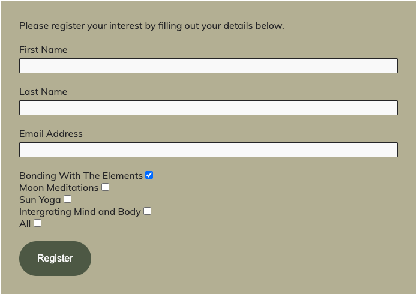
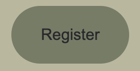

- The form also has a hover effect that changes color when hovering over an input field to enhance the user experience, making it more interactive and visually engaging. This subtle design feature helps guide users through the form, ensuring they can easily complete and submit their details.

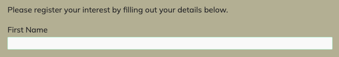

### Register Response Page

- The "Register Response" page is used to provide users with confirmation that their registration details have been successfully submitted.
- Upon submitting the registration form, users are redirected to this page, which opens in a new tab, reassuring them that their information has been received and is being processed.
- The page maintains the overall aesthetic and design consistency of the website, with a clean and straightforward layout that aligns with the studio's branding.
- The page informs users that a teacher will contact them shortly and they will receive an email with an information pack about the workshops and retreats they selected, providing immediate feedback and reducing any uncertainty about the registration process.

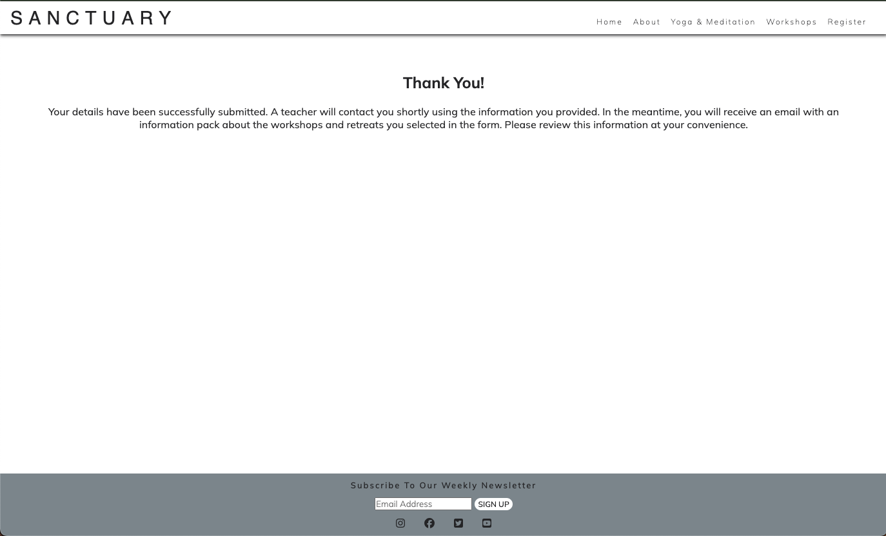

#### The Footer

- The footer section includes a "Subscribe To Our Weekly Newsletter" email input field, allowing users to enter their email address and sign up for weekly updates.
- The footer contains social media icons linking to Instagram, Facebook, Twitter, and YouTube, providing easy access to the studio's social media pages.
- Submit Button: When hovered over, the "Sign Up" button changes color to indicate interactivity, enhancing the user experience by providing visual feedback.
- Social Media Icons: Each social media icon changes color when hovered over, highlighting the icons and encouraging users to click on them. Once an icon is clicked this opens a new tab that takes them to the social media page.

## Technologies Used

- [HTML](https://developer.mozilla.org/en-US/docs/Web/HTML) - was used as the foundation of the site.
- [CSS](https://developer.mozilla.org/en-US/docs/Web/css) - was used to add the styles and layout of the site.
- [CSS Flexbox](https://developer.mozilla.org/en-US/docs/Learn/CSS/CSS_layout/Flexbox) - was used to arrange items on the page and to make pages responsive.
- [Figma](https://www.figma.com/) - was used to make wireframes for the website.
- [VSCode](https://code.visualstudio.com/) - was used as the tool to write and edit code.
- [Git](https://git-scm.com/) & [Gitpod](https://www.gitpod.io/) - was used for the version control of the website.
- [GitHub](https://github.com/) - was used to host the code of the website. 
- [CloudConvert](https://cloudconvert.com/webp-converter) - was used to convret all images on the site into webp.

## Design

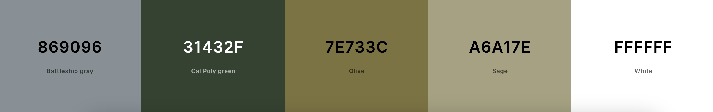

- Cal Poly Green and Sage were used as the main colors for the Sanctuary yoga website, as they convey a sense of natural wellness, balance, and tranquility. This creates an inviting and peaceful atmosphere that aligns with the holistic and calming principles of yoga.
- Olive, Battleship Gray, and White were chosen for the Sanctuary yoga website as they support a serene and grounded aesthetic. Olive conveys natural wellness and harmony, Battleship Gray adds a touch of stability and sophistication, and White enhances the feeling of openness and purity. Together, these colors create a balanced and calming environment that aligns with the holistic and tranquil principles of yoga.

## Typograhpy

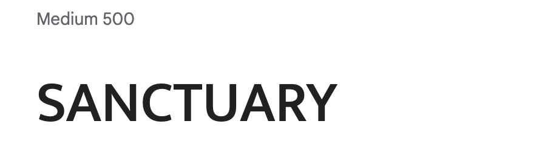

- Mukta Vaani 500 was chosen for the Sanctuary logo with letter spacing to convey a modern and approachable feel. The clean, well-spaced typography enhances readability and reflects the studio's commitment to clarity and openness. This choice aligns with the sanctuary's values of accessibility and inclusivity, creating a welcoming and professional brand identity.

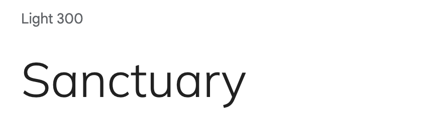

- Mulish Light 300 was chosen as the main font for the Sanctuary website to create a clean, modern, and elegant aesthetic. Its light weight and sleek design enhance readability and provide a sense of calm and sophistication.

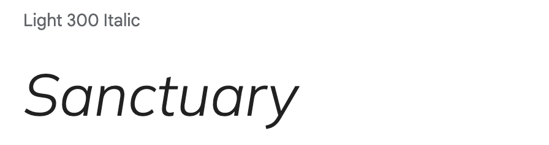
- Mulish Light 300 Italic was chosen for quotes to add elegance and emphasis, drawing attention to inspirational messages and enhancing the website's tranquil and mindful atmosphere.

## Wireframes 
- [Home Page]()
- [About Page]()
- [Yoga & Meditation Page]()
- [Workshops Page]()
- [Register Page]()

### Credits 
https://www.experienceretreats.com/bali-retreat-center-ubud - Source for outdoor-workshop.webp, gallery-image-11.webp

https://flexhk.com/wp-content/uploads/2019/07/ark-retreat-bali-yoga-shala.jpg - outdoor-workshop-2.webp

https://breathedreamgo.com/a-wellness-and-yoga-retreat-in-bali/ - gallery-image-5.webp

https://www.internationaltraveller.com/asia/indonesia/bali/is-this-balis-most-relaxing-hideaway/ - gallery-image-2.webp

https://www.pinterest.co.uk/pin/escape-haven-is-the-leading-womens-retreat-in-bali-with-yoga-surf-fitness-and-spa-retreat-packages-book--62839357282164894/ - pinterest, Escape Haven is the author - gallery-image-1.webp

https://thesoulfullifestyle.com.au/product/bali-retreat-yama/ - outdoor-workshop-3.webp

https://www.tripadvisor.co.uk/Hotel_Review-g12997583-d13331284-Reviews-Udara_Bali_Yoga_Detox_Spa-Seseh_Bali.html - gallery-image-4.webp

https://www.jimchapmancommunities.com/bali-training-retreat-k.html - gallery-image-3.webp

https://bookretreats.com/blog/10-top-yoga-retreats-in-bali/ - gallery-image-12.webp 

https://unsplash.com/photos/selective-focus-photography-of-black-buddha-figurine-on-green-leaf-0tTA6cewPr8 - Author Samuel Austin - unsplash - hero-image.webp

https://unsplash.com/photos/man-doing-yoga-on-rock-formation-P3gP2dZ5rnk - Jeremy Bishop - unsplash - Benefits-image.webp

https://unsplash.com/photos/woman-in-black-tank-top-sitting-on-brown-wooden-dock-during-daytime-xce530fBHrk - Author Jared Rice on Unsplash - gallery-image-6.webp 

https://unsplash.com/photos/woman-in-black-tank-top-and-black-shorts-raising-her-hands-rcSrzEf3NLs - Mor Shani Author on unsplashed - workshop-section.webp

https://www.takeustobali.com/home/best-places-to-organise-a-yoga-retreat-in-bali - gallery-image-7.webp

https://frstore.onlineclearance2024.ru/content?c=yoga+classes+in+seminyak+bali&id=26 - gallery-image-8.webp

https://www.baliecostay.com/activities/yoga-and-meditation/ - gallery-image-9.webp

https://www.themindfullifepractice.com/about - gallery-image-10.webp 

https://www.fourseasons.com/privatejet/journeys/timeless-encounters-2025/bali/ - outdoor-workshop-4.webp

https://www.cleanpng.com/png-vogue-italia-logo-fashion-magazine-model-agency-1774979/ - vogue.webp