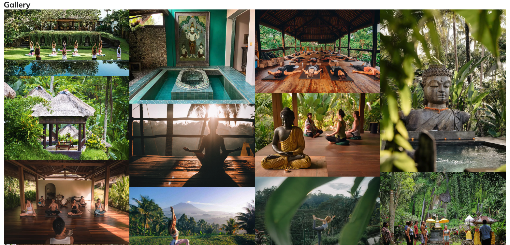

# Sanctuary

The Sanctuary website is a landing page designed for adults interested in traditional practices for their spiritual well-being. Sanctuary offers opportunities to attend workshops or retreats that integrate asanas, pranayama, and meditation as methods for enlightenment. These practices can be continued daily after the workshops.

Users of this website will find all the necessary information about Sanctuary: details about the studio, its location, contact information, an introduction to the yoga tradition offered, and a registration form. This site is targeted toward individuals who want to take the next step in their spiritual journey.

## Features

#### Navigation 
- The navigation bar is featured at the top of the page with the yoga studio's name, SANCTUARY, located at the top left corner and linking to the home page.
- The other navigation links are positioned on the right: Home, About, Yoga & Meditation, Workshops, and Register, all of which link to their respective HTML pages.
- The navigation uses a font similar to the studio name and features colors that contrast with the background.
- The navigation clearly displays the studio and website name, making it easy for users to find different pages of information. The currently selected page in the navigation is underlined, and pages also get underlined when hovered over.
 

#### The Header

- The header features a hero image of a Buddha meditating, visually indicating the website's focus.
- The header includes a quote on yoga, reinforcing the website's theme.
- This section provides clear information about the studio and uses strong imagery to visualise its purpose.

#### The Testimonial Section

- The testimonial section is designed to reinforce the studio's credibility.
- It features a prominently displayed Vogue brand logo, followed by a quote from Vogue praising the studio.

#### About Us Gallery
- The gallery feature in the "About Us" section provides a visual exposition of the studio and a glimpse into the setup of the workshops.
- The main image depicts a lady meditating on a mandapam in the forest, highlighting the unique and serene setting of the studio.
- Three smaller images underneath show the various locations where the workshops are conducted, giving prospective attendees a clear idea of the environment.

#### Find Us Map
- The "Find Us" section includes an embedded map. This provides users with a visual representation of the studio's location, making it easier for them to find the studio.
- The embedded map allows users to interact with it by zooming in, getting directions, and viewing streets. This provides all the necessary information without needing to leave the website.

#### Video

- The Yoga & Meditation section includes an embedded video. This provides users with a visual and auditory introduction to what yoga is, making it more engaging.
- The embedded video has autoplay turned off and is set to mute by default to give a better user experience.
- The controls are available for the user to play, pause, and adjust the volume as needed, ensuring they have full control over their viewing experience.

#### Workshop Grid
- The workshops section includes a visually appealing grid layout created using divs to demonstrate the different types of workshops offered at the studio.
- The grid organises workshops into four distinct categories: Bonding with the Elements, Moon Meditations, Sun Yoga, and Integrating Mind and Body. This clear organisation helps users quickly find the type of workshop they are interested in.
- Each category is represented by a coloured block with a descriptive title and a colour that contrasts with the background, making it easy for users to read, navigate, and understand the variety of workshops available.
- Each block includes an unordered list of specific workshops under the category, giving users detailed information at a glance and immediate insight into what each workshop entails.

#### Workshop Gallery
- The Gallery section includes a visually appealing and immersive grid layout that showcases various images related to the workshops and retreats offered at the studio.
- The gallery provides users with a visual representation of the studio's environment, giving them a taste of what the workshop setups and retreats look like.
- By including high-quality images of yoga sessions, meditation practices, and the serene surroundings, the gallery engages users and helps them visualise the unique setting and atmosphere of the studio.

#### Register Form 
- The "Find Out More" section includes a registration form that allows users to express their interest in the workshops and retreats offered at the studio.
- The form collects basic information such as the user's first name, last name, and email address, which are necessary for registration and follow-up communication.
- Users can select their areas of interest from the available workshops via checkboxes: Bonding With The Elements, Moon Meditations, Sun Yoga, Integrating Mind and Body, or an option to select All. This helps tailor the information and follow-up to their specific interests.
- The form is styled to match the overall aesthetic of the website, with a colour scheme that contrasts well with the background for readability.
- The form features a prominent "Register" button, encouraging users to submit their details and engage with the studio's offerings.
- The "Register" button leads to the register response page and has a hover effect where the text colour turns black and the background changes to a lighter shade of green. This hover effect provides visual feedback, enhancing the user experience by indicating that the button is interactive and ready to be clicked.

### Register Response Page

- The "Register Response" page is used to provide users with confirmation that their registration details have been successfully submitted.
- Upon submitting the registration form, users are redirected to this page, which opens in a new tab, reassuring them that their information has been received and is being processed.
- The page maintains the overall aesthetic and design consistency of the website, with a clean and straightforward layout that aligns with the studio's branding.
- The page informs users that a teacher will contact them shortly and they will receive an email with an information pack about the workshops and retreats they selected, providing immediate feedback and reducing any uncertainty about the registration process.

#### The Footer

### Credits 
https://www.experienceretreats.com/bali-retreat-center-ubud - Source for outdoor-workshop.webp, gallery-image-11.webp

https://flexhk.com/wp-content/uploads/2019/07/ark-retreat-bali-yoga-shala.jpg - outdoor-workshop-2.webp

https://breathedreamgo.com/a-wellness-and-yoga-retreat-in-bali/ - gallery-image-5.webp

https://www.internationaltraveller.com/asia/indonesia/bali/is-this-balis-most-relaxing-hideaway/ - gallery-image-2.webp

https://www.pinterest.co.uk/pin/escape-haven-is-the-leading-womens-retreat-in-bali-with-yoga-surf-fitness-and-spa-retreat-packages-book--62839357282164894/ - pinterest, Escape Haven is the author - gallery-image-1.webp

https://thesoulfullifestyle.com.au/product/bali-retreat-yama/ - outdoor-workshop-3.webp

https://www.tripadvisor.co.uk/Hotel_Review-g12997583-d13331284-Reviews-Udara_Bali_Yoga_Detox_Spa-Seseh_Bali.html - gallery-image-4.webp

https://www.jimchapmancommunities.com/bali-training-retreat-k.html - gallery-image-3.webp

https://bookretreats.com/blog/10-top-yoga-retreats-in-bali/ - gallery-image-12.webp 

https://unsplash.com/photos/selective-focus-photography-of-black-buddha-figurine-on-green-leaf-0tTA6cewPr8 - Author Samuel Austin - unsplash - hero-image.webp

https://unsplash.com/photos/man-doing-yoga-on-rock-formation-P3gP2dZ5rnk - Jeremy Bishop - unsplash - Benefits-image.webp

https://unsplash.com/photos/woman-in-black-tank-top-sitting-on-brown-wooden-dock-during-daytime-xce530fBHrk - Author Jared Rice on Unsplash - gallery-image-6.webp 

https://unsplash.com/photos/woman-in-black-tank-top-and-black-shorts-raising-her-hands-rcSrzEf3NLs - Mor Shani Author on unsplashed - workshop-section.webp

https://www.takeustobali.com/home/best-places-to-organise-a-yoga-retreat-in-bali - gallery-image-7.webp

https://frstore.onlineclearance2024.ru/content?c=yoga+classes+in+seminyak+bali&id=26 - gallery-image-8.webp

https://www.baliecostay.com/activities/yoga-and-meditation/ - gallery-image-9.webp

https://www.themindfullifepractice.com/about - gallery-image-10.webp 

https://www.fourseasons.com/privatejet/journeys/timeless-encounters-2025/bali/ - outdoor-workshop-4.webp

https://www.cleanpng.com/png-vogue-italia-logo-fashion-magazine-model-agency-1774979/ - vogue.webp