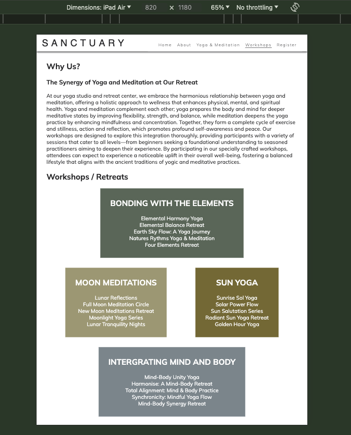

## Compatability
In order to confirm the correct functionality, responsiveness, and appearance:

The website was tested on the following browsers: Chrome, Firefox, Safari.

- Chrome:

- Firefox:

- Safari: 

## Responsiveness 

- The website was checked by devtools implemented in Chrome an Firefox browsers.

#### Main Page

#### About Page

#### Yoga & Meditation Page

#### Workshop Page

#### Register Page

- This website was checked with [Responsive Website Design Tester.](https://responsivedesignchecker.com/checker.php?url=https%3A%2F%2Fkelseyjaneadams.github.io%2Fsanctuary-project%2F&width=1400&height=700)

## Manual Testing

| Feature | Action | Expected result | Tested | Passed | Comments |
| --- | --- | --- | --- | --- | --- |
| Navbar | | | | | |
| Home | Click on the "Home" link | The user is redirected to the main page | Yes | Yes | - |
| About | Click on the "About" link | The user is redirected to the About page | Yes | Yes | - |
| Yoga & Meditation | Click on the "Yoga & Meditation" link | The user is redirected to the Yoga & Meditation page | Yes | Yes | - |
| Workshop | Click on the "Workshop" link | The user is redirected to the Workshop page | Yes | Yes | - |
| Register | Click on the "Register" link | The user is redirected to the Register page | Yes | Yes | - |
| Footer | | | | | |
| Instagram icon in the footer | Click on the Instagram icon | The user is redirected to the Instagram page | Yes | Yes | - |
| Facebook icon in the footer | Click on the Facebook icon | The user is redirected to the Facebook page | Yes | Yes | - |
| Twitter icon in the footer | Click on the Twitter icon | The user is redirected to the Twitter page | Yes | Yes | - |
| YouTube icon in the footer | Click on the YouTube icon | The user is redirected to the YouTube page | Yes | Yes | - |
| Email input | Enter the email | The email is entered | Yes | Yes | If user doesn't enter the email, the error message appears. If user enters not valid email, the error message appears |
| "Sign Up" button | Click on the "Sign Up" button | The user is redirected to the response page | Yes | Yes | - |
| Register Page | | | | | |
| First name input | Enter the first name | The first name is entered | Yes | Yes | If user doesn't enter the first name, the error message appears |
| Last name input | Enter the last name | The last name is entered | Yes | Yes | If user doesn't enter the last name, the error message appears |
| Email input | Enter the email | The email is entered | Yes | Yes | If user doesn't enter the email, the error message appears. If user enters not valid email, the error message appears |
| Bonding With The Elements Checkbox | Click on the checkbox | The checkbox is checked | Yes | Yes | These checkboxes are not required as the user can choose multiple or all and other reasons for registering interest |
| Moon Meditations Checkbox | Click on the checkbox | The checkbox is checked | Yes | Yes | These checkboxes are not required as the user can choose multiple or all and other reasons for registering interest |
| Sun Yoga Checkbox | Click on the checkbox | The checkbox is checked | Yes | Yes | These checkboxes are not required as the user can choose multiple or all and other reasons for registering interest |
| Intergrating Mind And Body checkbox | Click on the checkbox | The checkbox is checked | Yes | Yes | These checkboxes are not required as the user can choose multiple or all and other reasons for registering interest |
| "Register" button | Click on the "Register" button | The user is redirected to the response page | Yes | Yes | - |

## Validator Testing

- ### HTML
#### Home Page  

- No errors or warnings were found when passing through the official W3C validator

#### About Page

- No errors or warnings were found when passing through the official W3C validator

#### Yoga & Meditation Page

-- No errors or warnings were found when passing through the official W3C validator

#### Workshop Page

- No errors or warnings were found when passing through the official W3C validator

#### Register Page

- No errors or warnings were found when passing through the official W3C validator

### CSS

- - No errors or warnings were found when passing through the official W3C CSS validator.

## Lighthouse Report

- After using lighthouse in devtools I confirmed that the website is accessible, colours and fonts chosen are readable and is performing well.

#### Home Page

#### About Page

#### Yoga & Meditation Page

#### Workshop Page

#### Register Page

## Bugs
### Solved Bugs

1. The Sanctuary logo wouldn't fit on screens smaller than 390px due to the letter spacing and font-size.

*Solution: Created a media query for screens with a max-width of 390px and reduced the font-size and letter spacing.*

2. The navigation menu did not underline the current page because I forgot to update the active class on each page.

*Solution: Updated the active class to match the correct page.*

3. Images on the about page did not fill the entire section on desktop, leaving unpleasant white space on either side. This was due to setting a max-width for the divs containing the images.

*Solution: Removed the max-width from the div elements containing the images.*

4. The register form required all checkboxes to be ticked before submission. This happened because I forgot to remove the required attribute when changing from radio buttons to checkboxes.

*Solution: Removed the required attribute from all checkboxes as none were required.*

## Unsolved Bugs

None

## Mistakes
- Occasionally, I mistakenly indicated in my commit messages that I was debugging the layout when I was actually just changing the layout.

- My commit messages were all in the past tense due to the habit of describing what I had just done. I have learned that it is best practice to write them in the present tense, and I will adopt this in the future.

- Initially, I pushed to the repository after each individual commit because I feared that something might happen to my workspace and I would lose my work. As I was entirely new to coding, I wasn't aware that this was not considered best practice. However, as I gained more confidence and experience, I realized that it is generally better to push several commits at once. This change in practice has allowed me to manage my commits more efficiently and align better with standard development workflows.